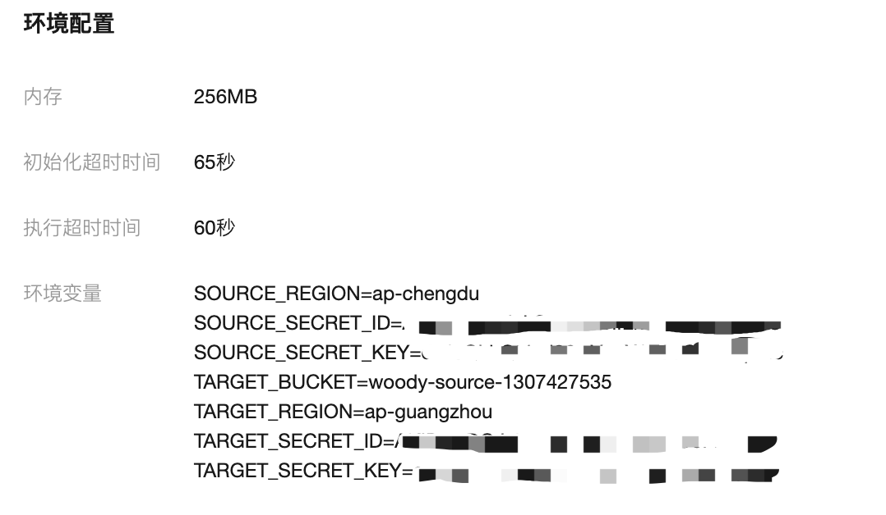

### 使用说明
这是一个跨账号的COS同步模版，可以将A账号的COS增量内容，同步到B账号的COS。

1. 下载代码，运行`gradle build`
2. 在build/lib目录下可以获得编译好的jar包，选择带-all后缀的jar进行部署。
3. 创建事件函数，并将内存修改为至少256M，执行超时时间根据下载上传文件的耗时决定，建议配置大于60秒。
4. 配置环境变量。需要提供源COS和目标COS的相关信息。具体如下图。
5. 添加COS触发器，此触发器是源COS的触发器。根据需要创建不同的触发条件。

