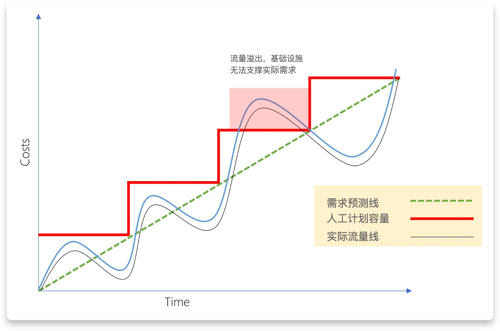
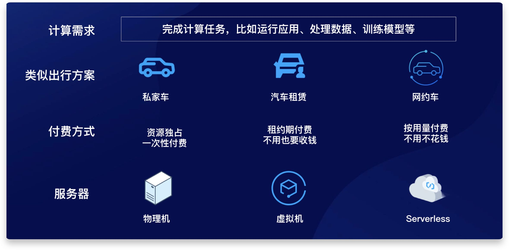
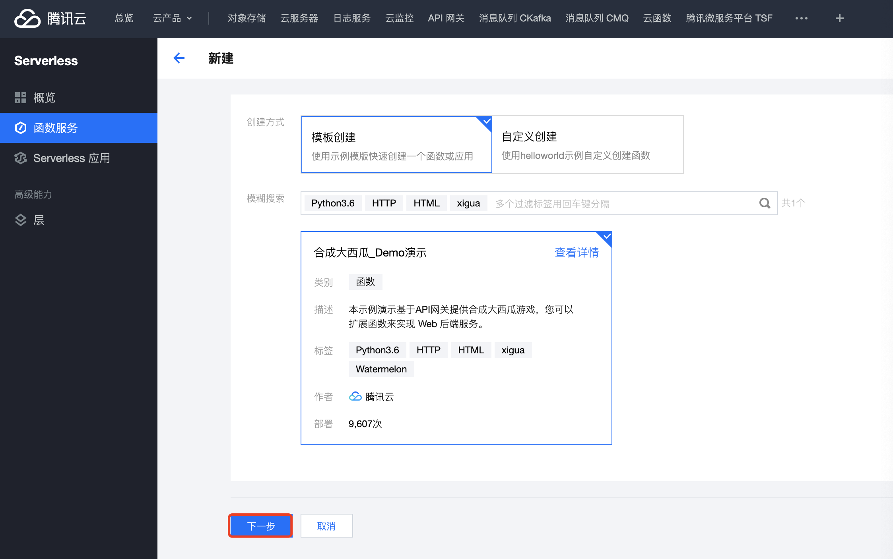
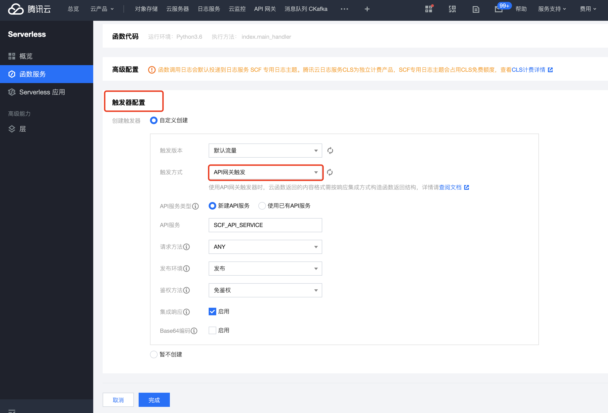
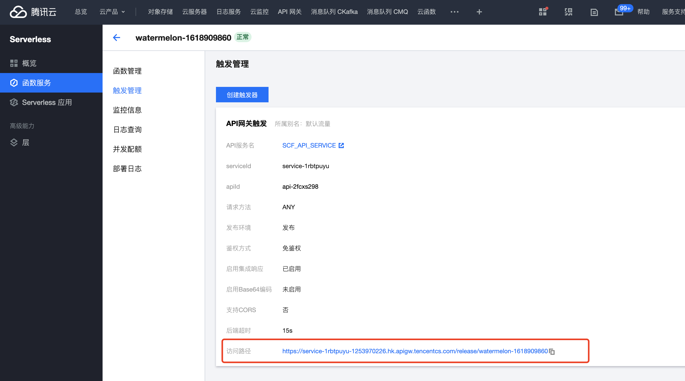

# Serverless 三步上云

[在线体验：H5小游戏三步上云 Demo成品效果](https://service-7cvf9nm4-1253970226.hk.apigw.tencentcs.com/release/watermelon-1618905918) (使用手机访问体验最佳)

### Serverless 简介

> Serverless 顾名思义，即为 “无服务器”，这里的 “无服务器” 并不是真正不需要服务器，而是将服务器的维护交给云厂商处理，开发者只需要管理业务层代码，并且按照计算使用量计费，大大节省了运维成本。以下图为例，传统部署方案，开发者必须先预估业务流量，并根据业务流量最大值购买服务器，往往会导致预估偏差导致流量溢出或资源浪费的问题。
>
> <center>
> 
> </center>
>
> Serverless 方案则类似于网约车，根据请求量，自动进行扩缩容，真正实现资源都按照请求来计费，不使用不付费。
>
> 
>
> <center>
> 
> </center>
>
> 目前，Serverless 的应用场景广泛，大部分传统业务均可以在 Serverless 云函数上完美支持。
>
> API 网关结合 SCF 云函数的使用场景非常丰富，这次实践的 Demo 作为抛砖引玉，希望大家以后在自己的Web 项目中，可以通过 SCF云函数+ API 网关实现更多功能。

### 使用的云端服务

- [x] [云函数](https://console.cloud.tencent.com/scf)
- [x] [API 网关](https://console.cloud.tencent.com/apigateway)

## 部署演示

1. 从下列模版地址进入云函数控制台，在【合成大西瓜_Demo 演示】模版下，点击下一步

```bash
https://console.cloud.tencent.com/scf/list-create?rid=5&ns=tabor&keyword=Python3.6%26HTTP%26HTML%26xigua
```


<center>

</center>


2. 配置触发器，选择API 网关

   

   <center>
   
   </center>

   

3. API 网关配置完成后，在触发管理，获取访问路径

   <center>
   
   </center>

   

   最后，完成 2个 Demo，记得晒出部署反馈，提交参与信息：

   

    [点击查看 Demo 2 Serverless 智能相册 : Serverless + Cos 对象存储 + API 网关 +AI 图像识别](https://github.com/awesome-scf/photo-album#readme) 

   

    [点击开始写部署体验反馈](https://cloud.tencent.com/developer/ask/240517) 

   

    [点击填写收集表：赢机酒，直飞北京现场参加 ServerlessDays 2021](https://docs.qq.com/form/page/DVUxhS3lxV0tOT2lZ?_w_tencentdocx_form=1#/fill) 


