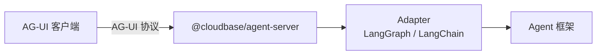

# @cloudbase/agent-server

将 AG-UI 兼容的 Agent 部署为 HTTP 服务。

## 什么是 AG-UI？

[AG-UI](https://ag-ui.com/) 是一个开放、轻量级、基于事件的协议，用于标准化 AI Agent 与用户界面的交互。它让 Agent 可以：

- 实时流式对话
- 双向状态同步
- 前端工具集成（Client Tools）
- 人机协作（Human-in-the-loop）

## 这个包解决什么问题？

- **快速部署 Agent 为 HTTP 服务**：一行代码将 Agent 部署为支持 AG-UI 协议的 HTTP 服务
- **多端点支持**：自动创建 `/send-message`、`/healthz` 等端点
- **云函数兼容**：自动适配腾讯云开发 HTTP 云函数环境

### 架构图



## 配合使用

| 包名 | 作用 |
|------|------|
| `@cloudbase/agent-adapter-langgraph` | LangGraph 工作流适配器 |
| `@cloudbase/agent-adapter-langchain` | LangChain Agent 适配器 |
| `express` | HTTP 服务框架 |

## 安装

```bash
pnpm add @cloudbase/agent-server express
```

## 快速开始

### 方式一：使用 run（最简单）

```typescript
import { run } from "@cloudbase/agent-server";
import { LanggraphAgent } from "@cloudbase/agent-adapter-langgraph";
import { workflow } from "./workflow.js"; // 你的 LangGraph 工作流

run({
  createAgent: () => ({
    agent: new LanggraphAgent({ workflow }),
  }),
  port: 9000,
});
```

### 方式二：使用 createExpressServer

创建一个配置好的 Express 应用：

```typescript
import { createExpressServer } from "@cloudbase/agent-server";
import { LanggraphAgent } from "@cloudbase/agent-adapter-langgraph";
import { workflow } from "./workflow.js";

const app = createExpressServer({
  createAgent: () => ({
    agent: new LanggraphAgent({ workflow }),
  }),
});

app.listen(9000, () => console.log("Listening on 9000!"));
```

### 方式三：使用 createExpressRoutes

将路由挂载到现有的 Express 应用：

```typescript
import { createExpressRoutes } from "@cloudbase/agent-server";
import { LanggraphAgent } from "@cloudbase/agent-adapter-langgraph";
import { workflow } from "./workflow.js";
import express from "express";

const app = express();

createExpressRoutes({
  createAgent: () => ({
    agent: new LanggraphAgent({ workflow }),
  }),
  express: app,
});

app.listen(9000, () => console.log("Listening on 9000!"));
```

## API 参考

### run

创建并启动 HTTP 服务。

```typescript
run({
  createAgent,
  port: 9000,
});
```

**参数：**

| 参数 | 类型 | 说明 |
|------|------|------|
| `createAgent` | `AgentCreator` | Agent 创建函数，见下方说明 |
| `port` | `number \| string` | 监听端口 |
| `basePath` | `string` | 可选，路由基础路径，默认为 `/`，云函数环境默认为 `/v1/aibot/bots/:agentId/` |
| `cors` | `boolean \| CorsOptions` | 可选，CORS 配置，默认启用 |
| `logger` | `Logger` | 可选，日志实例，用于记录服务端日志 |

### createExpressServer

创建一个配置好的 Express 应用。

```typescript
const app = createExpressServer({
  createAgent,
  cors: true,       // 可选，默认启用 CORS
});
```

**参数：**

| 参数 | 类型 | 说明 |
|------|------|------|
| `createAgent` | `AgentCreator` | Agent 创建函数，见下方说明 |
| `basePath` | `string` | 可选，路由基础路径 |
| `cors` | `boolean \| CorsOptions` | 可选，CORS 配置，默认启用 |
| `logger` | `Logger` | 可选，日志实例，用于记录服务端日志 |

### createExpressRoutes

将 AG-UI 路由挂载到现有的 Express 应用。

```typescript
createExpressRoutes({
  createAgent,
  express: app,
  basePath,         // 可选
});
```

**参数：**

| 参数 | 类型 | 说明 |
|------|------|------|
| `createAgent` | `AgentCreator` | Agent 创建函数，见下方说明 |
| `express` | `Express` | Express 应用实例 |
| `basePath` | `string` | 可选，路由基础路径，默认为 `/`，云函数环境默认为 `/v1/aibot/bots/:agentId/` |
| `logger` | `Logger` | 可选，日志实例，用于记录服务端日志 |

## 自动创建的端点

| 端点 | 说明 |
|------|------|
| `{basePath}send-message` | AG-UI 消息发送端点 |
| `{basePath}healthz` | 健康检查端点 |

## createAgent 参数

`createAgent` 返回一个对象：
- `agent`：符合 [AG-UI 协议](https://docs.ag-ui.com) 的 Agent
- `cleanup`：可选，请求结束后的清理函数

```typescript
type AgentCreator = (context?: {
  request: Request;     // 当前 HTTP 请求（Web Standard Request）
  logger?: Logger;      // 日志实例（带 requestId 上下文）
  requestId?: string;   // 请求追踪 ID
}) => AgentCreatorResult | Promise<AgentCreatorResult>; // 支持异步

type AgentCreatorResult = {
  agent: AbstractAgent | { toAGUIAgent(): AbstractAgent }; // AG-UI 兼容的 Agent
  cleanup?: () => void; // 可选，清理函数
};
```

使用适配器将你的 Agent 框架转换为 AG-UI 兼容的 Agent：

| 适配器 | 包名 | 说明 |
|--------|------|------|
| `LanggraphAgent` | `@cloudbase/agent-adapter-langgraph` | LangGraph 工作流适配器 |
| `LangchainAgent` | `@cloudbase/agent-adapter-langchain` | LangChain Agent 适配器 |

```typescript
import { LanggraphAgent } from "@cloudbase/agent-adapter-langgraph";

createAgent: () => ({
  agent: new LanggraphAgent({ workflow }),
})
```

**高级用法：** `createAgent` 可以接收请求上下文，也支持异步：

```typescript
createAgent: async (context) => {
  console.log("Request ID:", context.requestId);
  return { agent: new LanggraphAgent({ workflow }) };
}
```

## Logger

`logger` 参数用于记录服务端日志。需要实现以下接口：

```typescript
interface Logger {
  info?(message: string): void;
  info?(obj: object, message?: string): void;
  debug?(message: string): void;
  debug?(obj: object, message?: string): void;
  warn?(message: string): void;
  warn?(obj: object, message?: string): void;
  error?(message: string): void;
  error?(obj: object, message?: string): void;
  trace?(message: string): void;
  trace?(obj: object, message?: string): void;
  child?(bindings: object): Logger; // 创建带上下文的子 logger
}
```

**示例：**

```typescript
// 开发环境：使用 console
run({ createAgent, logger: console, port: 9000 });

// 生产环境：使用 pino
import pino from "pino";
run({ createAgent, logger: pino({ level: "info" }), port: 9000 });
```

## 文档

📚 完整文档请参阅 [云开发 Agent 开发指南](https://docs.cloudbase.net/ai/agent-development/)

## 相关资源

- [AG-UI 协议](https://docs.cloudbase.net/ai/agent-development/ag-ui-protocol)
- [框架开发指南](https://docs.cloudbase.net/ai/agent-development/frameworks/)
- [部署指南](https://docs.cloudbase.net/ai/agent-development/deploy/)
